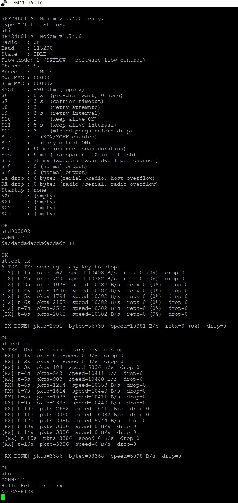

# nRF24L01 Hayes AT Modem

A full Hayes-compatible AT command modem emulator for Arduino, using the nRF24L01+ radio module as the wireless link. Connect two Arduinos and get a wireless serial pipe with proper modem semantics: dialling, answering, flow control, keep-alive, diagnostics, and status LEDs — or configure both as a completely silent, invisible wireless bridge.

Designed and tested on the **RF-Nano** (Arduino Nano with onboard nRF24L01+), and compatible with any Arduino Uno / Nano with an external nRF24L01+ module.

Current firmware version: **v1.98.0**

---

## Typical Session Example



---

## Features

- **Full Hayes AT command set** — `ATD`, `ATA`, `ATO`, `ATH`, `ATI`, `ATE`, `ATRE`, `AT&F`, `AT&Z`, `AT&Y`
- **Three link modes** — Transparent pipe, Hardware ACK, or Software Flow Control (**default**)
- **Cooperative half-duplex** — automatic yield token in SWFLOW mode eliminates RF collisions during simultaneous bidirectional transfers; no configuration required
- **S-registers S0–S18** — all timing, retry, keep-alive, flow control, scanner, and silent-mode parameters; saved to EEPROM
- **XON/XOFF flow control** on both serial and radio links; 256-byte circular buffers
- **Keep-alive / ping-pong** — active in both `S_DATA` and `S_CONNECTED`; pong delivered via yield mechanism for guaranteed receipt under heavy data flooding
- **Channel busy detection** before dialling
- **Channel auto-select** — `ATSETCHAUTO` scans all 126 channels and picks the quietest
- **Spectrum analyser** — `ATSPECTRUM` sweeps all 126 channels; ASCII density display
- **Speed tests** — four modes covering all use cases (see below)
- **Hardware reboot** — `ATREBOOT` via watchdog
- **Silent mode (S18)** — complete serial suppression; LEDs unaffected
- **Retry forever (S8=255)** — ideal for unattended wireless bridges
- **Connection uptime** in `ATI`
- **Autodial on startup** — up to 4 stored dial strings
- **8 status LEDs** — CD usable as hardware link-state signal for equipment
- **Configurable baud rate** 2400–1 000 000

---

## Hardware

### RF-Nano (recommended)

| Signal | Pin |
|---|---|
| CE | D7 *(hardwired)* |
| CSN | D8 *(hardwired)* |
| MOSI | D11 |
| MISO | D12 |
| SCK | D13 |

### Arduino Uno / Nano + external nRF24L01+

Same pinout. Add a 10–100 µF capacitor across VCC/GND to stabilise the 3.3 V supply.

### Status LEDs

Connect each via **330 Ω** to GND.

| LED | Pin | Colour | Meaning |
|---|---|---|---|
| **MR** Modem Ready | A0 | Green | Radio healthy |
| **TR** Terminal Ready | A1 | Green | Serial activity |
| **OH** Off Hook | A2 | Yellow | Any non-idle state |
| **CD** Carrier Detect | A3 | Yellow | Connected — use as equipment "link up" signal |
| **SD** Send Data | A4 | Red | TX packet flash |
| **RD** Receive Data | A5 | Red | RX packet flash |
| **HS** High Speed | D2 | Green | 2 Mbps air rate |
| **ER** Error | D3 | Red | TX failure / NO CARRIER / data loss |

> LEDs are unaffected by S18 silent mode. **CD (A3)** HIGH = link up, directly drivable by equipment logic.

---

## Dependencies

- [RF24 by TMRh20](https://github.com/nRF24/RF24) — Sketch → Include Library → Manage Libraries

---

## Getting Started

1. Flash the same sketch to both Arduinos.
2. Open a serial terminal at **115 200 baud**.
3. Set MACs: `ATSMYMAC=A1B2C3` on one, `ATSMYMAC=D4E5F6` on the other.
4. Optional auto-answer on node B: `ATS0=1`
5. Dial: `ATD D4E5F6` → `CONNECT`
6. Type freely. `+++` to escape, `ATO` to return, `ATH` to disconnect.

---

## AT Command Reference

### Connection

| Command | Description |
|---|---|
| `ATD XXYYZZ` | Dial remote MAC. Returns `BUSY` if channel occupied and S14=1. |
| `ATA` | Manually answer incoming call |
| `ATO` | Return to data mode after `+++` |
| `ATH` | Hang up or reject ring |
| `ATRE` | Re-dial last number |
| `ATS0=n` | Auto-answer after *n* rings (0 = off) |
| `+++` | Escape to command mode (1 s guard each side) |

### Configuration

| Command | Description |
|---|---|
| `ATI` | Full status — radio, uptime, state, MACs, RSSI, all S-registers, counters |
| `ATE0` / `ATE1` | Echo off / on |
| `ATSMYMAC=XXYYZZ` | Set own 3-byte MAC, saved to EEPROM |
| `ATSMYMAC?` | Query own MAC |
| `ATSETCH=nn` | Set RF channel 0–125 (default 97 = 2497 MHz) |
| `ATSETCH?` | Query RF channel |
| `ATSETCHAUTO` | Scan all 126 channels, auto-select quietest (idle only) |
| `ATSSPEED=n` | Air rate: `0`=250 kbps  `1`=1 Mbps (default)  `2`=2 Mbps |
| `ATSSPEED?` | Query air rate |
| `ATSBAUD=n` | Set serial baud rate; `OK` at old rate then switches |
| `ATSBAUD?` | Query baud rate |
| `ATSFLOW=n` | Link mode: `0`=transparent  `1`=HWACK  `2`=SWFLOW (default) |
| `ATSFLOW?` | Query link mode |
| `AT&F` | Factory reset |
| `AT&Zn=string` | Store dial string in slot *n* (0–3) |
| `AT&Zn?` | Query stored dial string |
| `AT&Yn` | Set startup autodial slot (fires 2 s after boot) |
| `AT&Y?` | Query startup slot |

### Diagnostics

| Command | Description |
|---|---|
| `ATSPECTRUM` | Sweep 126 channels, ASCII spectrum. Any key stops. |
| `ATPINGXXYYZZ` | Diagnostic ping to MAC `XXYYZZ` (idle only) |
| `ATREBOOT` | Hardware reboot via AVR watchdog |
| `ATTEST-TX` | Speed test transmitter |
| `ATTEST-RX` | Speed test receiver |
| `ATTEST-ECHO` | Echo reflector (human round-trip testing) |
| `ATTEST-TXRX` | Combined bidirectional test — run on both nodes simultaneously |

### S-Registers

Query: `ATSn?`. Set: `ATSn=value`. All saved to EEPROM.

| Reg | Default | Range | Description |
|---|---|---|---|
| S0 | 0 | 0–255 | Auto-answer ring count (0 = disabled) |
| S6 | 0 | 0–255 s | Pre-dial wait, non-blocking |
| S7 | 3 | 1–255 s | Carrier wait per attempt; also `ATPING` timeout |
| S8 | 3 | 0–255 | Retries: `0`=none  `255`=forever  else count |
| S9 | 3 | 0–255 s | Inter-retry interval |
| S10 | 1 | 0–1 | Keep-alive: `1`=on  `0`=off |
| S11 | 5 | 1–255 s | Keep-alive ping interval |
| S12 | 3 | 1–255 | Missed pings before `NO CARRIER` |
| S13 | 1 | 0–1 | XON/XOFF: `1`=on  `0`=off |
| S14 | 1 | 0–1 | Busy detect before dial |
| S15 | 50 | 1–255 | Busy detect samples (~2 ms each) |
| S16 | 5 | 1–255 ms | Transparent TX idle flush timeout |
| S17 | 20 | 1–255 | Spectrum/auto-select samples per channel (~500 µs each) |
| S18 | 0 | 0–1 | Silent mode: `1`=suppress all CLI output |

> **S8=255:** retries forever at `S7+S9` second intervals. `uint32_t` counter — no overflow concern. **S18=1:** `ATS18=0` always restores output even when silent.

---

## Supported Baud Rates

2400 · 4800 · 9600 · 19200 · 38400 · 57600 · **115200** (default) · 250000 · 500000 · 1000000

---

## Link Modes

### SWFLOW (`ATSFLOW=2`, default)

Pure stop-and-wait ARQ. Sends one `PKT_DATA`, waits 5 ms for `PKT_SWACK`, retransmits up to 4× on no reply. Supports cooperative half-duplex.

### HWACK (`ATSFLOW=1`)

Hardware ACK via nRF24L01 auto-ACK. Every packet confirmed before next is sent. ~50 kbps. No cooperative duplex.

### Transparent (`ATSFLOW=0`)

No framing, no ACK. Serial bytes → radio; radio → serial. Application handles all framing. Packets always 32 bytes (zero-padded after S16 ms idle).

**Maximum throughput:** `ATSSPEED=2` + `ATSFLOW=2` + `ATSBAUD=500000`

---

## Cooperative Half-Duplex

The nRF24L01 cannot transmit and receive simultaneously. In SWFLOW mode every `PKT_SWACK` carries a **yield token** — when the receiver has data or a pending pong to send, it replies with `PKT_SWACK_YIELD`. The sender pauses and waits up to 50 ms (pong) or 10 ms (data) for the receiver's packet, then resumes. Both sides alternate packet-by-packet under full duplex load.

Keep-alive pong packets are delivered via this mechanism — `PKT_PING` receipt sets `pendingPong=true`, which causes `swflowAckData` to request a yield window, guaranteeing pong delivery even under heavy data flooding. Pong is sent 3× with 2 ms gaps for additional reliability.

---

## Silent Mode (S18)

`ATS18=1` suppresses all serial output. Modem is completely invisible to the host. LEDs continue normally. `ATS18=0` always works to restore output.

**Transparent bridge setup:**
```
Both modems:    ATE0, ATS18=1
TX modem:       ATS8=255, AT&Z0=XXYYZZ, AT&Y0, ATREBOOT
RX modem:       ATS0=1, ATREBOOT
```

After reboot: TX boots silently, dials forever, connects when RX is in range. CD (A3) HIGH = link up.

---

## Channel Auto-Select

```
ATSETCHAUTO
```

Scans all 126 channels (idle only), S17 independent RPD measurements each, picks quietest, saves to EEPROM. Output:

```
Scanning channels.......
Best channel: 42 (0/20 hits — saved)
```

---

## Speed Tests

Requires an active connection. Escape first with `+++`, then issue the test command.

### ATTEST-TX

Floods `TestFromXXYYZZ_NNNNNNNNNN\r\n` packets (29 bytes, own MAC + 10-digit counter). Any keypress stops.

```
[TX] t=5s  pkts=1760  speed=10237 B/s  retx=2 (0%)  drop=0  KA:sent OK
[TX DONE] pkts=8800  bytes=255200  avg=10208 B/s  retx=5 (0%)  drop=0
```

Received data (e.g. from echo side) is silently discarded — only KA packets are processed.

### ATTEST-RX

Counts and discards all received data. Any keypress stops.

```
[RX] t=5s  pkts=1758  speed=10208 B/s  drop=0  KA:rcvd OK
[RX DONE] pkts=8796  bytes=255084  avg=10179 B/s  drop=0
```

### ATTEST-ECHO

Reflects received bytes back to sender via `txBuf`. Useful for human round-trip testing — press a key on the TX side and see it echoed back. Any keypress stops.

```
[ECHO] t=5s  pkts=42  speed=1218 B/s  drop=0  KA:rcvd OK
```

### ATTEST-TXRX

Run on **both nodes simultaneously** — each node independently generates a TX stream and counts received bytes. No coordination needed; any keypress stops that node.

```
[TXRX] t=5s  tx=760pk  4495B/s  retx=2(1%)  rx=758pk  4466B/s  drop=tx:0/rx:0  KA:sent OK
[TXRX DONE] tx_pkts=3800  tx_avg=4437 B/s  retx=45 (1%)  rx_pkts=3795  rx_avg=4408 B/s  drop=tx:0/rx:0
```

Stats columns: `tx=` cumulative packet count, then interval bytes/s; `rx=` same for received direction.

### Test Packet Format

```
TestFromXXYYZZ_NNNNNNNNNN\r\n  (29 bytes)
└──────┘└────┘ └────────┘
prefix  MAC   10-digit counter
```

Both `ATTEST-TX` and `ATTEST-TXRX` embed the sender's MAC — useful for visually identifying traffic in the raw stream when multiple nodes are active.

### KA During Tests

All test commands run non-blocking inside `loop()` — keep-alive pings and pongs continue normally during tests. Stats lines include a KA status field:

| KA field | Meaning |
|---|---|
| `KA:OK` | No missed pings, not waiting for pong |
| `KA:sent OK` | Ping sent this second and pong received |
| `KA:sent wait` | Ping sent, waiting for pong |
| `KA:miss N/M` | N consecutive unanswered pings out of M allowed |
| `KA:Xs/Ys` | Answerer: X seconds since last ping / Y second window |
| `KA:timeout!` | Answerer watchdog about to fire |

---

## Keep-Alive

KA operates in both `S_DATA` and `S_CONNECTED`. `kaResetWindow()` is called on every state transition (`+++`, `ATO`, test start/stop) to prevent false disconnects.

| Side | S10=1 | S10=0 |
|---|---|---|
| **Initiator** | Sends pings every S11 s; NO CARRIER after S12 misses | No pings |
| **Answerer** | Replies; NO CARRIER after `S11×S12` s silence | Replies; never times out |

Default: 5 s × 3 = 15 s window. Both sides disconnect simultaneously.

---

## Dial Sequence

```
ATD XXYYZZ
  → S14=1: scan S15 samples — BUSY if occupied
  → attempt 1: PKT_CONN → wait S7 s → PKT_ACK → CONNECT
      timeout → NO CARRIER - retry N/M, wait S9 s
  → attempts 2 … (S8 or forever)
  → NO CARRIER (final, only when S8 ≠ 255)
```

---

## ATI Output

```
nRF24L01 AT Modem v1.98.0
Radio   : OK
Uptime  : 1h 23m 45s
State   : CONNECTED (data mode)
Flow mode: 2 (SWFLOW)
Channel : 97
Speed   : 1 Mbps
Own MAC : 000001
Rem MAC : 000002
RSSI    : -30 dBm (approx)
S6 … S18: ...
TX drop : 0 bytes
RX drop : 0 bytes
KA role : initiator (sends pings)
KA miss : 0
```

---

## Packet Protocol

32-byte fixed payload. Header: 3 bytes (`type`, `seq`, `len`). Payload: up to 29 bytes.

| Type | Value | Description |
|---|---|---|
| PKT_DATA | 0x01 | User data |
| PKT_XON | 0x02 | Resume sending |
| PKT_XOFF | 0x03 | Pause sending |
| PKT_DISC | 0x04 | Disconnect (sent 3× with 10 ms gaps) |
| PKT_CONN | 0x05 | Connection request |
| PKT_ACK | 0x06 | Connection accepted |
| PKT_NACK | 0x07 | Reserved |
| PKT_SWACK | 0x08 | SWFLOW ACK |
| PKT_PING | 0x09 | Keep-alive ping |
| PKT_PONG | 0x0A | Keep-alive reply (sent 3× via yield) |
| PKT_SWACK_YIELD | 0x0B | SWFLOW ACK + yield TX to remote |
| PKT_DIAG_PING | 0x0C | Diagnostic ping (ATPING) |
| PKT_DIAG_PONG | 0x0D | Diagnostic pong |
| PKT_TEST_START | 0x0E | Reserved |
| PKT_TEST_STOP | 0x0F | Reserved |

---

## EEPROM Layout

94 bytes (0–93), magic `0xA5` at offset 8. All writes use `EEPROM.update()`.

| Offset | Size | Contents |
|---|---|---|
| 0–2 | 3 B | Own MAC |
| 3–5 | 3 B | Remote MAC |
| 6 | 1 B | RF channel |
| 7 | 1 B | Speed enum |
| 8 | 1 B | Magic (`0xA5`) |
| 9 | 1 B | S0 |
| 10 | 1 B | Flow mode |
| 11 | 1 B | Baud index |
| 12–79 | 68 B | Dial strings ×4 |
| 80 | 1 B | Startup slot |
| 81–93 | 13 B | S6–S18 |

---

## Troubleshooting

| Symptom | Cause | Fix |
|---|---|---|
| MR off, ER blinking | nRF24L01 not detected | Check wiring; add 100 µF cap on VCC/GND |
| ER flashing during transfer | Buffer overflow | Enable XON/XOFF (`ATS13=1`) |
| BUSY right after disconnect | RPD grace period | Wait ~200 ms |
| NO CARRIER immediately | Wrong channel or remote not listening | Check `ATSETCH`; try `ATSETCHAUTO` |
| Garbled after ATSBAUD | Terminal not switched | Change terminal baud or `ATREBOOT` |
| Link drops when idle | KA timeout | Increase S11/S12 or `ATS10=0` |
| Binary data corrupt | XON/XOFF intercepting 0x11/0x13 | `ATS13=0` |
| No output at all | S18=1 silent mode | Type `ATS18=0` (always works) |
| Wrong baud after update | Stale EEPROM index | `ATSBAUD=115200` or `AT&F` |
| Test NO CARRIER during test | KA miss during flooding | Fixed in v1.85+ — update firmware |
| TXRX rx count tiny | pendingPkt path not counted | Fixed in v1.98.0 — update firmware |

---

## Version History

| Version | Summary |
|---|---|
| v1.0–v1.39 | Initial build through SWFLOW full rewrite to stop-and-wait |
| v1.40–v1.55 | Baud rates, speed test, link quality metrics, payload B/s |
| v1.56–v1.65 | Stop packet reliability, non-blocking tests, KA state fixes |
| v1.66–v1.70 | PKT_DATA KA watchdog refresh, `kaResetWindow()` unified |
| v1.71–v1.73 | RX packet counting, PKT_PING/PONG in ACK wait loop |
| v1.74 | Uptime in ATI, ATRE, ATSETCHAUTO |
| v1.75–v1.77 | Query `\r\n` framing, rxDropped double-count, production review |
| v1.78–v1.79 | ATTEST-ECHO non-blocking, removed unreliable pong wait |
| v1.80 | ACK wait drains all FIFO packets |
| v1.81–v1.84 | KA stats in test output, answerer KA progression display |
| v1.85–v1.87 | Pong via cooperative yield (`pendingPong`), XOFF bypass |
| v1.88 | Pong sent 3× with 2 ms gaps for reliability |
| v1.89 | Adaptive yield window: 50 ms for pong, 10 ms for data |
| v1.90–v1.91 | XON/XOFF honoured in test TX fill loop and echo reflect |
| v1.92–v1.93 | Speed overflow fix (long tests), echo one-packet-at-a-time |
| v1.94–v1.95 | ATTEST-TXRX, MAC in test packet, buildTestPacket updated |
| v1.96–v1.97 | TXRX stats fixes, all test flags cleared on start, `retxPct` fix |
| v1.98 | `pendingPkt` path counts test RX packets — fixes TXRX rx asymmetry |

---

## License

MIT — free to use, modify, and distribute. Attribution appreciated.
